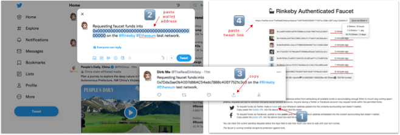
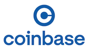

# MetaMask

## Install MetaMask
> *MetaMask is a wallet for `Ethereum` (and other tokens) that works as a browser extension. It connects to sites and application within your browser (i.e. after visiting the website you click on the `MetaMask` icon to connect your wallet with that website).*

1. Visit [Metmask](https://metamask.io/) and locate the extension that is compatible with your browser *(supported browsers are: `Chrome`, `Firefox`, `Edge` and `Brave`)*. 
2. Install the extension ->  *the Metamask Icon   appears in our browser*
3. Click on the icon  in your browser and follow the setup process.
4. Store/write down the `secret recovery phrase`: *it's the master key to your wallet!* 

## Become familiar with MetaMask
We recommend to **pin** MetaMask to your browser:

### One word about accounts
You can add more accounts to your wallet. *(This can be useful e.g. to learn how to transfer money between accounts.)* Every account will then be available in all your testnets and your mainnet. Every account has an account number (also called `account address`) and a `private key`. You will use both quite often. Whenever you "change" something on the blockchain (transfer money, mint NFT, etc.) you need your account address and your private key - think of them as your *name* and your *signature*.  
The `secret key` belongs to your wallet and therefore to all your accounts. You never use it on the blockchain. *(typical usecases for your secret key is: setting up your wallet on a new computer or smart phone or browser)* 

### Add Testnet
>MetaMask will be your most important tool in the blockchain world. The nice thing about MetaMask: it allows you to use `testnets`. Testnets are ... which allow you to discover, play around and test your application. You can also deposit money (i.e. tokens) on your testnet. But if you want to buy a real NFT you need to use your mainnet with real `ETH` *Let's add some money to your wallet ...*. This will also be explained further in the Week 1 Coursebook.

In order to access and connect to a Testnet it needs to be added to your metamask. You can do that by clicking this link: https://umbria.network/connect/ethereum-testnet-rinkeby and press **switch network** after your metamask was prompted to open.

### Get `Ether` for your wallet
The process for adding `ether` to your wallet depends on the testnet. 

#### Rinkeby Testnet
1. [Rinkeby Faucet](https://rinkebyfaucet.com/)
    - very quick: just paste you wallet address
    - only 0.1 Eth and you have to wait 24h to claim Eth againg
2. [Rinkeby Authenticated Faucet](https://faucet.rinkeby.io/)
    - you need `twitter` or `facebook` account
    - for Twitter: 
        1. click on the twitter link
        2. a sample tweet in your twitter account opens
        3. paste your wallet address in that tweet and tweet
        4. copy your tweets link ("share tweet") and paste it into the faucet
    - you can add up to 18.75 Eth (every 3 days)  
   

#### Kovan Testnet   
Unfortunately, Eth for `Kovan` is a little bit more difficult to get than for `Rinkeby`. You can get `Kovan` Eths from a couple of sites:
1. [Kovan Faucet](https://faucet.kovan.network/)
    - site was offline recently 😕
2. [Gitter](https://gitter.im/kovan-testnet/faucet#)
    - you need to sign on with your `twitter`, `github` or `gitlab` account
    - then click on `join room` at the buttom of the page and paste in your wallet address
    - only 0.001 Eth and you have to wait 24h to claim ETH again
3. [Ethdrop](https://ethdrop.dev/)
    - very simply: just paste your wallet address
    - only 0.001 Eth and you have to wait 24h to claim ETH again
#### Mainnet
(we recommend not to deposit real `eth`, i.e. on the mainnet - at least not for now until you become more confident within the blockchain world.). But of course if you want to interact with the "real" blockchain (in a way that you *change* the blockchain, e.g.: buying "real" NFTs, minting "real" tokens, exchanging "real" crypos, etc.) you need to have real `eth`. The quickest way to buy eth is within MetaMask: you can buy via `Paypal`, `Apple Pay`, `Credit Card`, `Bank Transfer`, etc.
Keep in mind that you also need eth for transactions which usually does not cost money (e.g. ...). I.e. because for most transactions you need to pay a transaction fee, so called `gas fee`. It is the compensation for the `miner` who "helps" you with your transaction. 
*But more on this later...*

# Other Wallets
Another famous wallet which functions similar to MetaMask is `Coinbase`:   
  
Coinbase can store other cryptos while MetaMask focuses on ETH and ERC-20 tokens. Coinbase also functions as a browser add-on. You can download and install it [here](https://www.coinbase.com). But we don't need it for our course.